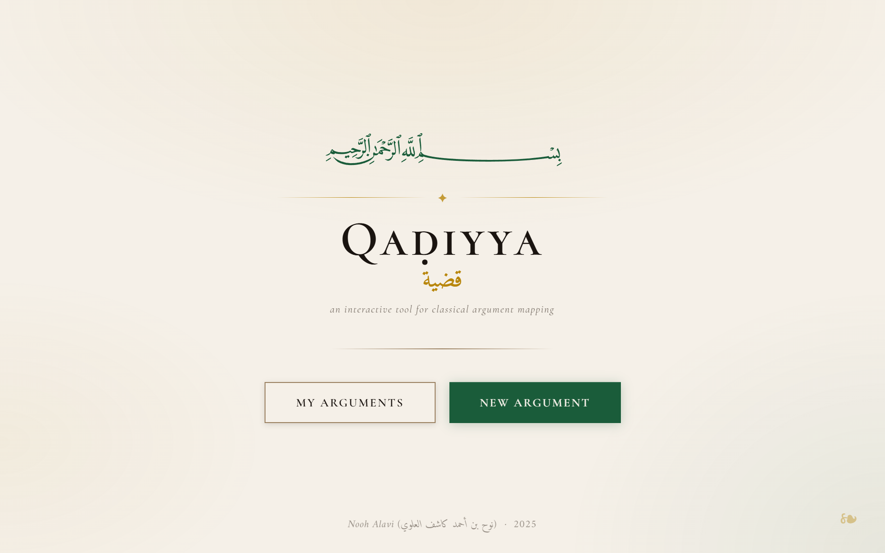
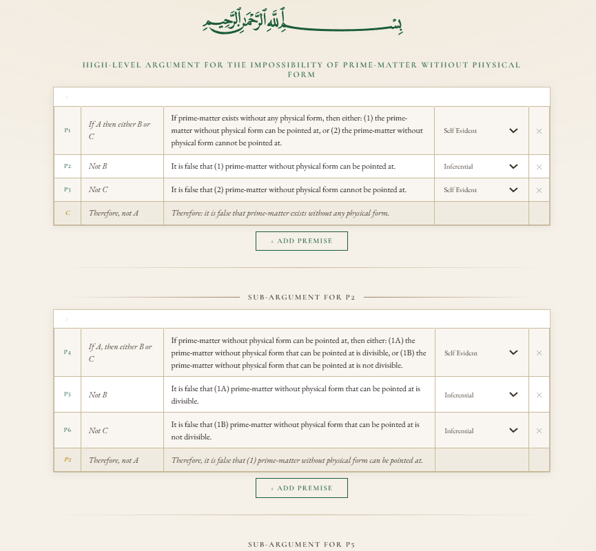

<strong>بسم الله الرحمن الرحيم</strong>

  
  
  
  
  

<h1>
  &nbsp; Qaḍiyya | قضية
</h1>

  
<b>📂 Click to expand Table of Contents</b>

  
  1. [💡 Inspiration Behind Qaḍiyya](#-inspiration-behind-qaḍiyya)
  2. [🧠 Project Goals](#-project-goals)
  3. [📦 Current Features](#-current-features)
  4. [🏗️ Tech Stack & Architecture](#️-tech-stack--architecture)

 

**Qaḍiyya** is a **work-in-progress** interactive web application for constructing, visualizing, and analyzing logical arguments in a structured, hierarchical format **inspired by the traditional science of Islamic logic [*manṭiq*]**.

**Named after the Arabic *manṭiqī* term for the proposition** (i.e. a statement that can either be true or false, used to construct rational arguments), Qaḍiyya's purpose is to make the structure of complex reasoning visible. 

**Classical *manṭiq* trains students to think in orderly, hierarchical steps, but texts rarely display these relationships in a visual way**. Qaḍiyya helps the student transform those implicit structures into clear, interactive charts; letting users see how premises connect, how sub-arguments branch, and how a conclusion necessarily emerges from its supporting statements.

<small>*Pictured above: a screenshot of **Qaḍiyya**'s homepage*</small>

## 💡 Inspiration behind Qaḍiyya
Qaḍiyya grew out of my own studies in the traditional Islamic sciences of Classical Logic [*manṭiq*], Avicennan-Neoplatonic Philosophy [*falsafa*], and Dialectical Theology [*kalām*]—especially during lessons with my teacher [Shaykh Hamza Karamali](https://hamzakaramali.com/), where we <u>regularly</u> build these detailed charts by hand, translating the rigorous philosophical arguments of luminaries like [Athīr al-Dīn al-Abharī](https://en.wikipedia.org/wiki/Athir_al-Din_al-Abhari) and [Saʿd al-Dīn al-Taftāzānī](https://en.wikipedia.org/wiki/Al-Taftazani) in their works like the *Isagoge*, *Hidāyat al-ḥikma*, and *Sharḥ al-ʿaqāʾid al-nasafiyya*. 

The chart format used in Qaḍiyya is not something I invented—**it is the exact structure taught to us by Shaykh Hamza in [his courses](https://whyislamistrue.com/kalam)**, reflecting the disciplined, hierarchical reasoning of classical *manṭiq* and *kalām*.

<small>*Pictured above: a demonstration of **Qaḍiyya** using one of Athīr al-Dīn al-Abharī's positive arguments for Aristotelian hylomorphism*</small>

These charts are incredibly powerful tools: they force the student to break a proof into its smallest propositions, see exactly how each statement supports the next, and understand the inner architecture of reasoning in a way that textual explanations alone can’t provide. Not only that, but each proposition is classified as either "inferential" [*naẓarī*], meaning it requires another argument to establish, or "non-inferential" [*ḍarūrī*], meaning it does not. With the help of these charts, the student can take each argument back to its non-inferential premises, and understand where the arguments can rationally be critiqued and where they cannot.

But as the arguments grew more complex, I found myself constantly redrawing, renumbering, and reorganizing these diagrams. **I wanted a way to preserve the rigor and clarity of the method without the mechanical friction that slows down the learning process.**

**Qaḍiyya simply digitizes and streamlines the process of making these charts.** It lets students build, edit, and rearrange argument trees with ease, preserving the intellectual rigor while removing the tedium. The goal is **not** to replace deep philosophical engagement, but rather to make the process smoother, more intuitive, and more accessible—**so that the student can spend less time wrestling with formatting, and more time wrestling with ideas**.

## 🧠 Project Goals
### 1. Make argument structure visible — without replacing real thinking
Arguments often become confusing; <u>not</u> because the ideas are deep, but because the structure of the reasoning is buried, tangled, or assumed.
    
Qaḍiyya does not attempt to replace the intellectual work of analyzing or constructing arguments. Instead, it removes the friction of tracking structure manually, so that the student can focus on what actually matters: the reasoning itself.

This tool helps make arguments outwardly clear by:

- Mapping arguments into numbered premises

- Allowing unlimited levels of sub-premises

- Showing precise parent–child relationships

- Updating numbering automatically

- Displaying the whole structure in a clean, readable format

**The goal is to clarify reasoning, not automate it.**

### 2. Bring *manṭiq*-style discipline to modern argument mapping
Modern argument-mapping apps exist, but none capture the hierarchical rigor of classical *manṭiq* and *kalām*.

Qaḍiyya is designed to assist the student in practicing that discipline—<u>not</u> to replace it.

It supports:

- Hierarchical reasoning in the style of classical texts

- Categorization of statements by premise type (self-evident, empirical, transmitted, etc.)

- The habit of distinguishing levels of premises

- A structured, consistent approach to forming arguments

**It is a tool for working <u>with</u> *manṭiq*, not automating or simplifying the underlying intellectual craft.**

### 3. Provide a clean, intuitive interface that streamlines, not shortcuts
The UI is intentionally minimal so that the student’s cognitive energy goes toward thinking—not fiddling with layout.

- Add a premise with one click

- Delete a premise with one click

- Automatic renumbering

- Clear dropdown for premise type

- Responsive nested layout

**This removes mechanical distractions while preserving full intellectual engagement.**

### 4. Serve as an educational assistant for real logical study
Qaḍiyya is meant to aid learning, teaching, and research—not replace careful philosophical analysis.

It is useful for:

- Students studying classical/Islamic logic

- Madrasa instructors preparing or explaining arguments

- Researchers organizing *kalām*, *falsafa*, or *uṣūl* proofs

- Anyone who wants to strengthen clarity in reasoning

**It can be used to dissect arguments from classical texts or to construct new ones for teaching or research.**

### 5. Be extensible for future sophistication
The codebase is structured for future enhancements that support deeper study, including but not limited to:

- Export argument charts (PNG/PDF)

- Save/load argument trees

- Convert arguments to modern symbolic notation

- Collaborative editing

- A library of sample arguments

- LLM-integration in order to translate the charts into natural language arguments

- And much more!

**All expansions maintain the same principle: the tool *assists* thinking; it does <u>not</u> replace it!**

## 📦 Current Features
- **Dynamic Argument Construction** – Add premises or nested sub-premises with a single click, allowing for unlimited depth in logical proofs.
- **Recursive Deletion Logic** – Deleting a parent premise automatically and cleanly removes all associated sub-arguments, maintaining the integrity of the logic tree.
- **Intelligent Auto-Renumbering** – Real-time numbering updates (e.g., P1, P2, P3) ensure that the structural hierarchy remains clear even as the argument is reorganized.
- **Premise Classification** – Integrated dropdowns to categorize statements by their epistemic type (e.g., inferential [*naẓarī*] vs. non-inferential [*ḍarūrī*]), a core requirement of classical Islamic logic [*manṭiq*].
- **Hierarchical Visualization** – A clean, responsive UI specifically designed to display the "inner architecture" of an argument at a glance.
- **Modular Backend Architecture** – A Flask-based system designed for scalability, separating the logic of argument traversal from the front-end rendering.

## 🏗️ Tech Stack & Architecture
- **Framework:** **Python (Flask)** — The backbone of the application, managing routing and the complex backend logic required for structured argument mapping.
- **Frontend:** **Vanilla JS / HTML5 / CSS3** — Built without heavy external frameworks to ensure a fast, lightweight, and highly responsive user experience. 
- **Templating:** **Jinja2** — Utilized modular macros to handle the recursive rendering of argument components, keeping the codebase DRY and maintainable.

 

- **Core Logic:** **Recursive Tree Traversal** — Custom recursive algorithms manage the hierarchical data structure, ensuring that premise relationships and numbering remain consistent across all levels of nesting.
- **Data Integrity:** **Parent-Child Relationship Model** — The system is structured to preserve the logical flow from non-inferential facts to their inferential conclusions.

 

**And Divine facilitation is from God Alone | وبالله التوفيق**