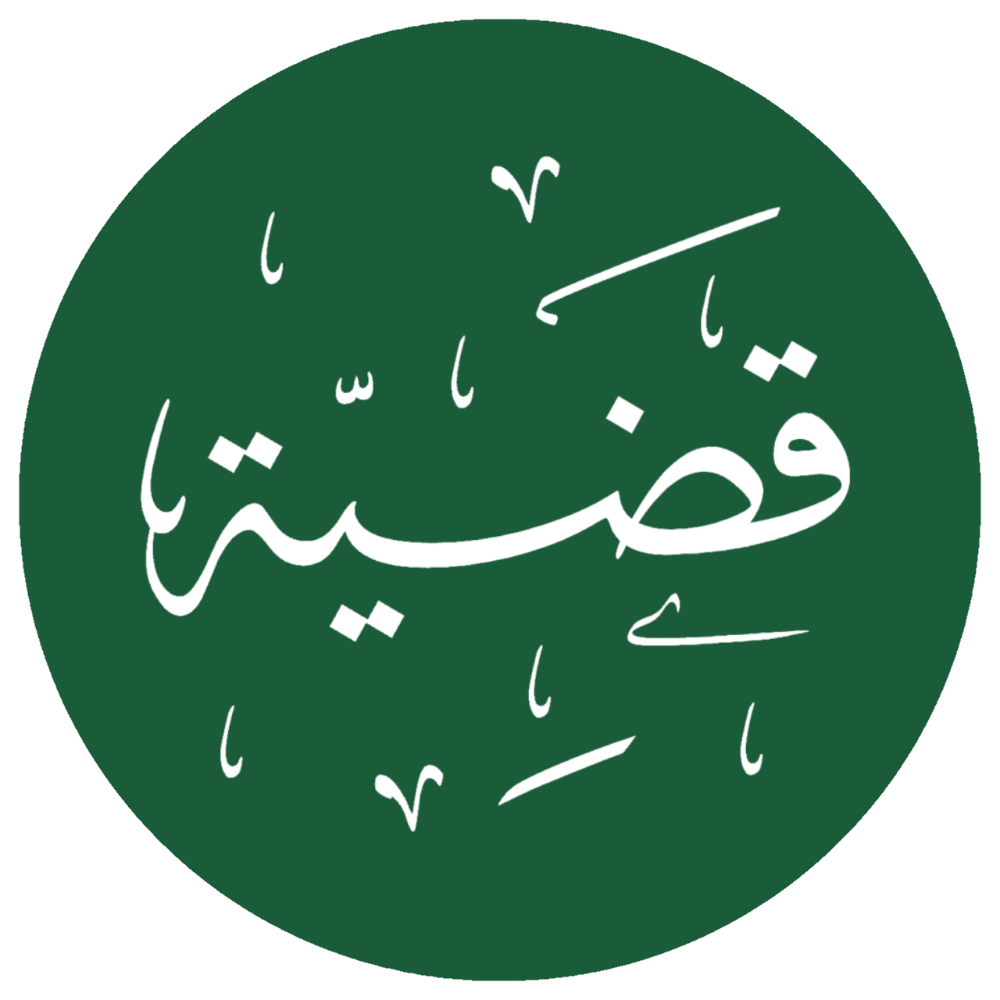
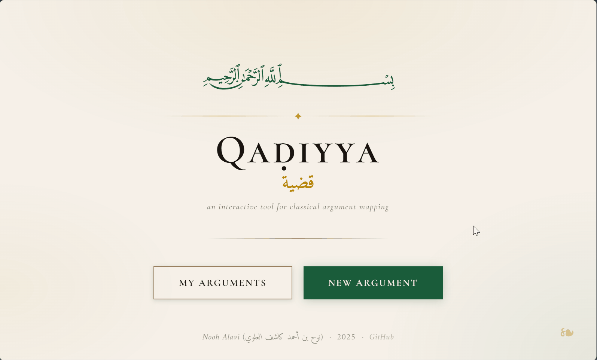
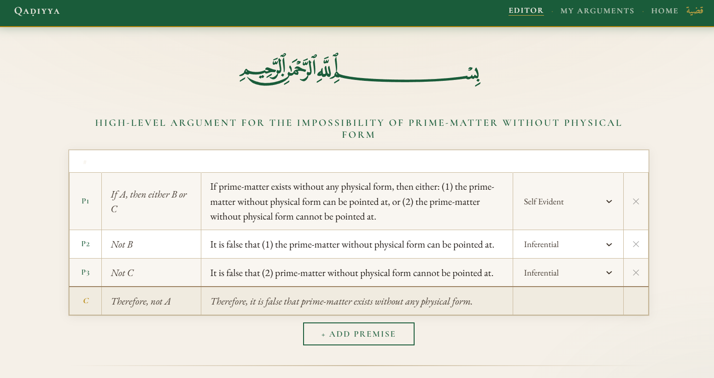
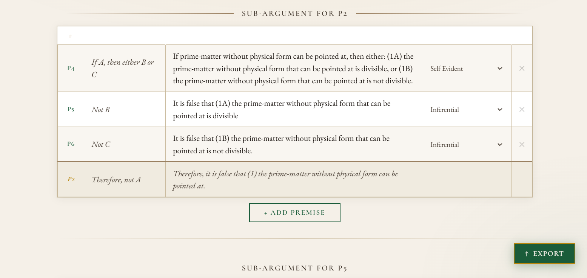
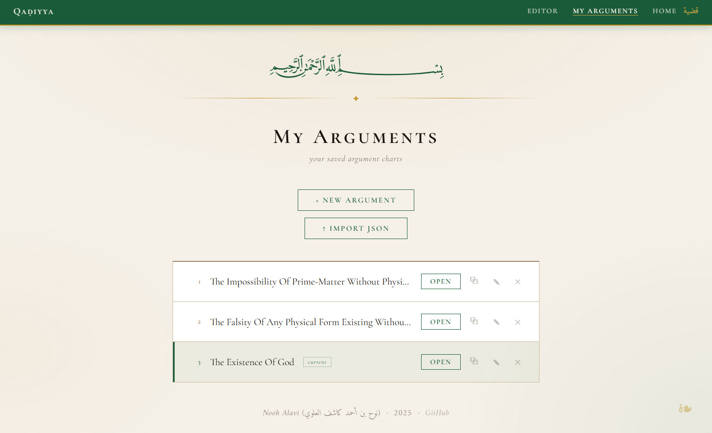
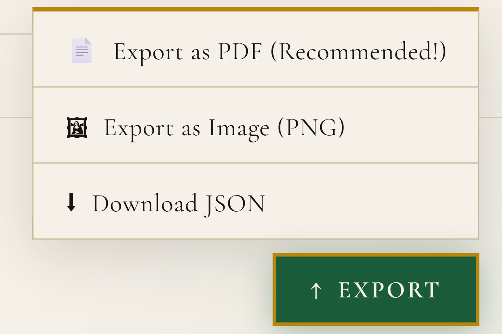

<p align="center"><strong>بسم الله الرحمن الرحيم</strong><p>
<p align="center">
  
  
  <a href="https://qadiyya.up.railway.app/">
    
  </a>
</p>

<h1>
  &nbsp; Qaḍiyya | قضية
</h1>

> 🌐 **Try it live:** [qadiyya.up.railway.app](https://qadiyya.up.railway.app/)
>
> ***Note:** Sessions are browser-based — your arguments persist across refreshes but are not tied to an account. Clearing your cookies or switching browsers will start a fresh workspace.*

<details>
  <summary><b>📂 Click to expand Table of Contents</b></summary>
  
  1. [💡 Inspiration Behind Qaḍiyya](#-inspiration-behind-qaḍiyya)
  2. [🧠 Project Goals](#-project-goals)
  3. [📦 Current Features](#-current-features)
     1. [🧩 Argument Construction](#-argument-construction)
     2. [💾 Project Management](#-project-management)
     3. [📤 Export](#-export)
     4. [🎨 Design & UX](#-design--ux)
  4. [🏗️ Tech Stack & Architecture](#️-tech-stack--architecture)
  5. [📜 Credits & Acknowledgements](#-credits--acknowledgements)
</details>
<br/>

**Qaḍiyya** is a work-in-progress interactive web application for constructing, visualizing, and analyzing logical arguments in a structured, hierarchical format—**inspired by the traditional science of Islamic logic [*manṭiq*]**.

Named after the Arabic *manṭiqī* term for a proposition—a statement that can be true or false—Qaḍiyya is designed to **make the structure of complex reasoning visible**.

**Classical *manṭiq* trains students to think in orderly, hierarchical steps, but texts rarely display these relationships in a visual way**. 

Qaḍiyya helps the student transform those implicit structures into clear, interactive charts, allowing them to see how premises connect, how sub-arguments branch, and how a conclusion necessarily emerges from its supporting statements.



<small>*Pictured above: a demo of **Qaḍiyya***</small>

## 💡 Inspiration behind Qaḍiyya
Qaḍiyya grew out of my own studies in the traditional Islamic sciences of Classical Logic [*manṭiq*], Avicennan-Neoplatonic Philosophy [*falsafa*], and Dialectical Theology [*kalām*]—especially during lessons with my teacher [Shaykh Hamza Karamali](https://hamzakaramali.com/), where we <u>regularly</u> build these detailed charts by hand, translating the rigorous philosophical arguments of luminaries like [Athīr al-Dīn al-Abharī](https://en.wikipedia.org/wiki/Athir_al-Din_al-Abhari) and [Saʿd al-Dīn al-Taftāzānī](https://en.wikipedia.org/wiki/Al-Taftazani) in their works like the *Isagoge*, *Hidāyat al-ḥikma*, and *Sharḥ al-ʿaqāʾid al-nasafiyya*. 

The chart format used in Qaḍiyya is not something I invented—**it is the exact structure taught to us by Shaykh Hamza in [his courses](https://whyislamistrue.com/kalam)**, reflecting the disciplined, hierarchical reasoning of classical *manṭiq* and *kalām*.




<small>*Pictured above: a demonstration of **Qaḍiyya** using one of Athīr al-Dīn al-Abharī's positive arguments for Aristotelian hylomorphism*</small>

These charts are incredibly powerful tools: they force the student to break a proof into its smallest propositions, see exactly how each statement supports the next, and understand the inner architecture of reasoning in a way that textual explanations alone can’t provide. Not only that, but each proposition is classified as either "inferential" [*naẓarī*], meaning it requires another argument to establish, or "non-inferential" [*ḍarūrī*], meaning it does not. With the help of these charts, the student can take each argument back to its non-inferential premises, and understand where the arguments can rationally be critiqued and where they cannot.

But as the arguments grew more complex, I found myself constantly redrawing, renumbering, and reorganizing these diagrams. **I wanted a way to preserve the rigor and clarity of the method without the mechanical friction that slows down the learning process.**

**Qaḍiyya simply digitizes and streamlines the process of making these charts.** It lets students build, edit, and rearrange argument trees with ease, preserving the intellectual rigor while removing the tedium. The goal is **not** to replace deep philosophical engagement, but rather to make the process smoother, more intuitive, and more accessible—**so that the student can spend less time wrestling with formatting, and more time wrestling with ideas**.

## 🧠 Project Goals
### 1. Make argument structure visible — without replacing real thinking
Arguments often become confusing; <u>not</u> because the ideas are deep, but because the structure of the reasoning is buried, tangled, or assumed.
    
Qaḍiyya does not attempt to replace the intellectual work of analyzing or constructing arguments. Instead, it removes the friction of tracking structure manually, so that the student can focus on what actually matters: the reasoning itself.

This tool helps make arguments outwardly clear by:

- Mapping arguments into numbered premises

- Allowing unlimited levels of sub-premises

- Showing precise parent–child relationships

- Updating numbering automatically

- Displaying the whole structure in a clean, readable format

**The goal is to clarify reasoning, not automate it.**

### 2. Bring *manṭiq*-style discipline to modern argument mapping
Modern argument-mapping apps exist, but none capture the hierarchical rigor of classical *manṭiq* and *kalām*.

Qaḍiyya is designed to assist the student in practicing that discipline—<u>not</u> to replace it.

It supports:

- Hierarchical reasoning in the style of classical texts

- Categorization of statements by premise type (self-evident, empirical, transmitted, etc.)

- The habit of distinguishing levels of premises

- A structured, consistent approach to forming arguments

**It is a tool for working <u>with</u> *manṭiq*, not automating or simplifying the underlying intellectual craft.**

### 3. Provide a clean, intuitive interface that streamlines, not shortcuts
The UI is intentionally minimal so that the student’s cognitive energy goes toward thinking—not fiddling with layout.

- Add a premise with one click

- Delete a premise with one click

- Automatic renumbering

- Clear dropdown for premise type

- Responsive nested layout

**This removes mechanical distractions while preserving full intellectual engagement.**

### 4. Serve as an educational assistant for real logical study
Qaḍiyya is meant to aid learning, teaching, and research—not replace careful philosophical analysis.

It is useful for:

- Students studying classical/Islamic logic

- Madrasa instructors preparing or explaining arguments

- Researchers organizing *kalām*, *falsafa*, or *uṣūl* proofs

- <u>Anyone</u> who wants to strengthen clarity in reasoning

**It can be used to dissect arguments from classical texts or to construct new ones for teaching or research.**

### 5. Be extensible for future sophistication
The codebase is structured for future enhancements that support deeper study, including but not limited to:

- Convert arguments to modern symbolic notation

- User accounts & an authorization system

- Collaborative editing

- A library of sample arguments

- LLM-integration in order to translate the charts into natural language arguments

- And much more!

**All expansions maintain the same principle: the tool *assists* thinking; it does <u>not</u> replace it!**

## 📦 Current Features

### 🧩 Argument Construction
- **Dynamic Premise Construction** – Add premises or nested sub-premises with a single click, with unlimited depth in logical proofs.

- **Recursive Deletion** – Deleting a premise automatically removes all its nested sub-arguments, maintaining the integrity of the logic tree.

- **Intelligent Auto-Renumbering** – Premise numbers (P1, P2, P3…) update automatically as the argument is reorganized.

- **Premise Classification** – Integrated dropdowns to categorize each premise by epistemic type: inferential [*naẓarī*] or one of several non-inferential [*ḍarūrī*] categories (self-evident, observational, empirically observed, introspectively observed, tested, intuited, mass-testified, subconsciously inferred). There is also an option to further annotate the premise, in order to either add more details or to critique it.

- **Inferential Sub-Argument Generation** – When a premise is marked as inferential, a two-premise sub-argument table is automatically generated beneath it.

### 💾 Project Management
- **Multi-Project Support** – Create, manage, and switch between multiple argument projects from a dedicated "My Arguments" page.



<small>*Pictured above: a screenshot of **Qaḍiyya**'s "My Arguments" page, where all of the user's arguments are saved.*</small>

- **Session-Based Isolation** – Each browser session has its own isolated workspace. Thus, multiple users visiting the app simultaneously will not share or overwrite each other's data.

- **JSON Persistence** – Each session's projects are serialized and saved to disk as `JSON`, persisting across page refreshes and server restarts.

- **Rename, Delete, and Duplicate** – Projects can be renamed, deleted, or duplicated directly from the arguments page.

### 📤 Export
- **Download JSON** – Export the current argument as a `.json` file for backup or future import.

- **Export as PDF** – Export a properly paginated A4 `.PDF` file with the same aesthetic as the image export, suitable for sharing or printing. **This is the recommended method of exporting arguments**.

- **Export as Image (PNG)** – Export a clean, styled image of the argument with parchment background and full typography.



<small>*Pictured above: the "Export" button from **Qaḍiyya**'s argument editor page.*</small>

### 🎨 Design & UX
- **Manuscript-Inspired UI** – Parchment tones, deep ink, emerald green, and gold accents. Typography uses Cormorant SC (titles/labels), EB Garamond (body), and Amiri (Arabic text).

- **Smart Reloading** – Text edits save silently without a page reload. Only structural changes (adding premises, deleting, or marking inferential) trigger a reload, with scroll position preserved across all reloads.

- **Floating Export Button** – A fixed bottom-right export button gives access to all three export formats from anywhere in the editor.

- **Consistent Navigation** – A fixed navigation bar on the editor and arguments pages provides direct links between Editor, My Arguments, and Home.

- **Modular Backend Architecture** – A Flask-based system designed for scalability, separating the logic of argument traversal from the front-end rendering.

## 🏗️ Tech Stack & Architecture

### Backend
- **Python (Flask)** — Routing, session management, and all server-side logic.

- **WeasyPrint** — HTML/CSS-to-PDF rendering for export, with full support for Arabic text and custom fonts.

- **pdf2image + Pillow** — PDF-to-PNG conversion for image export, with page-margin cropping and vertical page stitching.

### Frontend
- **Jinja2** — Server-side templating for dynamic argument rendering.

- **Vanilla JS / HTML5 / CSS3** — No frontend frameworks. Fast, lightweight, and fully responsive.

- **Google Fonts** — Cormorant SC, Cormorant Garamond, EB Garamond, Amiri.

### Deployment & Persistence
- **Railway** — Cloud hosting platform utilized for automated CI/CD and production deployment.

- **Persistent Volumes** — Data is stored in a dedicated Railway volume to ensure that session-based JSON records persist across deployments and server restarts.

- **Gunicorn** — A production-grade WSGI HTTP Server used to handle concurrent requests in the cloud environment.

### Data Model
- **Core Logic: Recursive Tree Traversal** — Custom recursive algorithms manage the hierarchical data structure, ensuring that premise relationships and numbering remain consistent across all levels of nesting. Each `Node` stores a `barebones` dict (`"parent"` and `"child"` symbolic forms), a `written_premise`, a `PremiseType`, and a list of child `Node`s. The root node acts as the argument's conclusion.

  - **Data Integrity**: Parent-Child Relationship Model — The system is structured to preserve the logical flow from non-inferential facts to their inferential conclusions.

- **MantiqMap** — Manages the tree: breadth-first numbering, chart representation generation, node lookup, and JSON serialization/deserialization.

- **Session-keyed JSON files** — One `.json` file per browser session in a `sessions/` directory, containing all of that user's projects and their active project ID.

- **Backups & File Sharing** — The JSON-ified arguments can be downloaded via the "Export" button, and can then be uploaded back into the editor for further use. This is useful both for (1) locally backing up one's work, and for (2) sharing one's projects with others for the sake of collaboration (or critique!).

### Installation

```bash
# Clone the repository
$ git clone git@github.com:NoohAlavi/Qadiyya.git
$ cd Qadiyya

# Install Python dependencies
$ pip install flask weasyprint pdf2image pillow gunicorn

# Install poppler (required by pdf2image)
# Ubuntu/Debian:
$ sudo apt install poppler-utils
# macOS:
$ brew install poppler

# Run the app
$ python app.py
```

> **Note:** Add `sessions/` to your `.gitignore` to avoid committing user data.

## 📜 Credits & Acknowledgements
- **The Golden Chain:** This project is a digital tribute to the **intellectual giants of the Islamic scholarly tradition**, whose historical commitment to reason, logic, and foundational clarity continues to inspire seekers of truth today.

- **Intellectual Inspiration:** As detailed in the [inspiration section](#-inspiration-behind-qaḍiyya), the specific charting format and the whole idea behind the project are a direct result of my studies with **[Shaykh Hamza Karamali](https://hamzakaramali.com/)**.

- **Visual Identity:** The custom Qaḍiyya logo and favicon were designed by my friend **Talḥah ʿAbd al-ʿAzīz al-Dakkāwī**.

- **Typography & Fonts:** This project utilizes the **Amiri**, **EB Garamond**, and **Cormorant** typefaces via [Google Fonts](https://fonts.google.com/).

</br>

**And Divine facilitation is from God Alone | وبالله التوفيق**